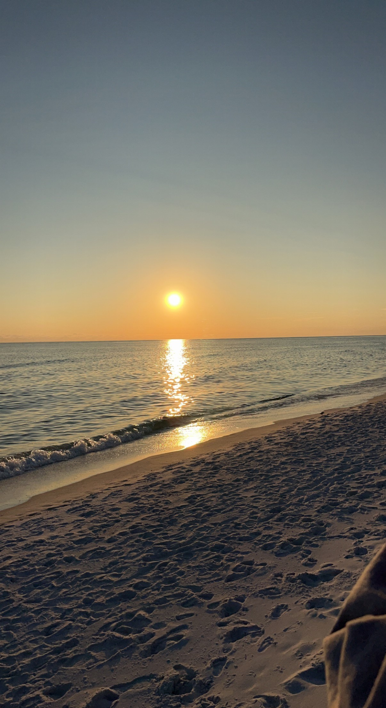

<!-- Scrolling TikTok Banner -->

    🎵 Follow us on TikTok! 
    <a href="https://www.tiktok.com/@5tidesfl" target="_blank">
        <i class="fab fa-tiktok"></i>
    </a>

# Welcome to Vacation-30A - Your Vacation Rental Located at Santa Rosa Beach, FL on Highway 30A

Your perfect beach retreat at Santa Rosa Beach, FL on 30A. Minutes away from the sugary white sands of Florida's Emerald Coast.

## Our Amenities
- Located on Highway 30A on the Peaceful West End
- Two Bedrooms and Two Full Bathrooms
- Sleeps 5 - 1 King Bed, 1 Full Bed and 1 Twin Bed
- Steps Away from the Pool
- Modern Kitchen with All the comforts of home
- Back Patio Facing the Preserve
- Free Wifi
- Smart TVs in Each Bedroom and Living Room
- Minutes from Topsail Hill Preserve State Park

## Our Testimonials
<iframe src="https://www.google.com/maps/embed?pb=!1m18!1m12!1m3!1d220545.80494094512!2d-86.05918728442042!3d30.26477764190027!2m3!1f0!2f0!3f0!3m2!1i1024!2i768!4f13.1!3m3!1m2!1s0x20b2a6733de11d6f%3A0x8d50d88867e4f1c4!2s5Tides!5e0!3m2!1sen!2sus!4v1735866600375!5m2!1sen!2sus" width="600" height="450" style="border:0;" allowfullscreen="" loading="lazy" referrerpolicy="no-referrer-when-downgrade"></iframe>

## Contact Us
Email us at: [contact@vacation-30a.com](mailto:5tidesfl@gmail.com)

<a href="https://www.airbnb.com/rooms/811737612454728329?source_impression_id=p3_1706392206_doHyVHsBGtePPOPP" class="button">
  Book Now
</a>

## Featured Images

## More Information About Vacation-30A (please fill out our form)

<button id="email-form-trigger">Subscribe for Updates</button>

  

    ×
    <h2>Stay Updated!</h2>
    <iframe src="https://docs.google.com/forms/d/e/1FAIpQLSdKELiSHNu1MGxzGKqZYZfZzZAV7jjXTAwcBQz0T27F_se8eQ/viewform?embedded=true" width="640" height="586" frameborder="0" marginheight="0" marginwidth="0">
      Loading…
    </iframe>
  

<link rel="stylesheet" href="https://cdnjs.cloudflare.com/ajax/libs/font-awesome/5.15.3/css/all.min.css">

### Visit our main website: [5Tides at Topsail](https://5tidesfl.com)
